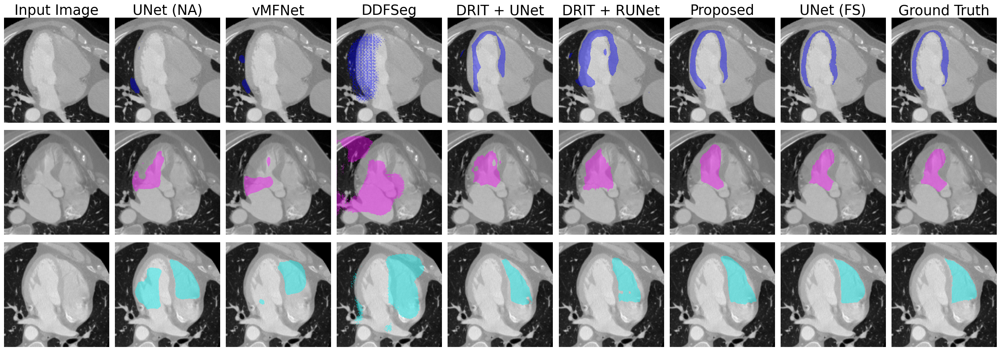

# Enhancing Cross-Modal Medical Image Segmentation through Compositionality and Disentanglement

This repository contains the implementation of several disentangled representation learning models for cross-modal medical image segmentation.
In particular, it contains the implementation of our proposed method, where we introduced compositionality into a cross-modal segmentation framework to enhance performance and interpretability, while reducing computational costs. 
Below, you can see some examples results.



Contact: Aniek Eijpe (a.eijpe@uu.nl)

# Code structure
- The `baselines` folder contains the code for the baselines; No Adaptation UNet, Full Supervision UNet, vMFnet, DRIT++ with UNet and with ResUNet and DDFSeg. Please refer to this folder for more information on how to run these baselines.
- The `src` folder contains the code for our proposed method. Please refer to this folder for more information on how to run our proposed method.
- The `data` folder contains the links to out preprocessed data, some notebooks to explore the data and our preprocessing steps.
- The `results` folder contains some example results of our method.


# System Requirements
If you would like to run our implementation, please use the following code to create the conda environment that is used. 

```
conda env create -f environment.yml
conda activate gpu_env
```

# Visualization

`visualize_comp.py` and `visualize.py` contains code to make the figures like the examples in the `results` folder. Please change the file and data paths in the code accordingly to make your own figures. 

# Paper
Please cite our paper if you find the code useful for your research.

```
Add citation
```

# Acknowledgements

Parts of the code are based on [vMFNet](https://github.com/vios-s/vMFNet), [DRIT](https://github.com/HsinYingLee/DRIT) and [DDFSeg](https://github.com/Endless-Hao/DDFSeg).