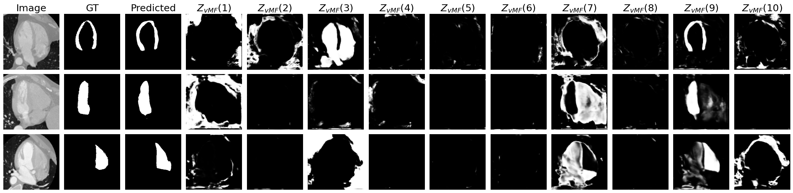

# Enhancing Cross-Modal Medical Image Segmentation through Compositionality

This repository contains the implementation of our paper "Enhancing Cross-Modal Medical Image Segmentation through Compositionality", accepted at Deep Generative Models workshop @ MICCAI 2024 (DGM4MICCAI). For our submitted manuscript with added funding acknowledgements and authors' names and affiliations, but without post submission improvements or corrections, please click [here](https://arxiv.org/abs/2408.11733). The final version is not published yet. 

Our proposed network is an end-to-end cross-modal segmentation framework that enforces compositionality on the learned representations using learnable von Mises-Fisher kernels. These kernels facilitate content-style disentanglement in the learned representations, resulting in compositional content representations that are inherently interpretable and effectively disentangle different anatomical structures. 
Below, you can see some examples results.




Contact: Aniek Eijpe (a.eijpe@uu.nl)

# Code structure
- The `baselines` folder contains the code for the baselines; No Adaptation UNet, Full Supervision UNet, vMFnet, DRIT++ with UNet and with ResUNet and DDFSeg. Please refer to this folder for more information on how to run these baselines.
- The `src` folder contains the code for our proposed method. Please refer to this folder for more information on how to run our proposed method.
- The `data` folder contains the links to out preprocessed data, some notebooks to explore the data and our preprocessing steps.
- The `results` folder contains some example results of our method.


# System Requirements
If you would like to run our implementation, please use the following code to create the conda environment that is used. 

```
conda env create -f environment.yml
conda activate gpu_env
```

# Visualization

`visualize_comp.py` and `visualize.py` contains code to make the figures like the examples in the `results` folder. Please change the file and data paths in the code accordingly to make your own figures. 

# Paper
Please cite our paper if you find the code useful for your research.

```
Final version not published yet
```

# Acknowledgements

Parts of the code are based on [vMFNet](https://github.com/vios-s/vMFNet), [DRIT](https://github.com/HsinYingLee/DRIT) and [DDFSeg](https://github.com/Endless-Hao/DDFSeg).
