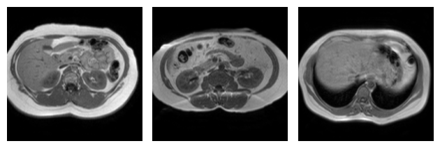

# Data preprocessing
This folder contains the code for the data preprocessing of the MM-WHS and CHAOS dataset and the visualization of the preprocessed data. 

- The `exploratory_notebooks` folder contains notebooks used for visualizing the preprocessed data. 
- In the `MMWHS` folder, you can download the preocossed MMWHS data from this google drive, and also the synthetic data created by the DRIT model
- In the `CHAOS` folder, you can download the preocossed CHAOS data from this google drive, and also the synthetic data created by the DRIT model

## MMWHS 
To preprocess the MMWHS data, first download the MMWHS data from [here](https://github.com/FupingWu90/CT_MR_2D_Dataset_DA), into the `MMWHS` folder.
Then run the following code from this directory (i.e. `data/`)

```
source activate gpu_env
python preproc_mmwhs.py
```


## CHAOS
To preprocess the MMWHS data, first download the CHAOS data from [here](https://github.com/FupingWu90/CT_MR_2D_Dataset_DA), into the main directory (i.e., `CrossModal-DRL`).
Then run the following code from this directory (i.e. `data/`)

```
source activate gpu_env
python preproc_chaos.py
```

