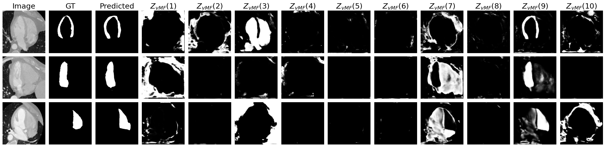

# Enhancing Cross-Modal Medical Image Segmentation through Compositionality and Disentanglement

This repository contains the implementation of our proposed method, where we introduced compositionality into a cross-modal segmentation framework to enhance performance and interpretability, while reducing computational costs. 
Below, you can see some examples results of our method with the interpretable compositional representations.



# Code structure
- The `composition` folder contains all the code for the compositional layer.
- The `models` folder contains the code for our proposed model (`crosscompcsd.py`) and all its sub-modules. 
- The `data` folder contains the code for the data loaders of the CHAOS and MMWHS datasets.
- The `checkpoints` folder contains the checkpoints of the trained models. To load the checkpoints in this folder, please load them from [Huggingface]().
- The `logs` folder contains the Tensorboard results of the different experiments.

# Training
## MM-WHS
To train the model on the MM-WHS dataset with CT as source domain, MRI as target domain to segment the myocardium with our default train settings (i.e. bs=4, lr=0.0001, vc_num=10, k_folds=5), please run the following code from this directory (i.e. `src/`).

```
source activate gpu_env
python train.py --cp checkpoints/proposed_MMWHS --name MYO_10_Target_MRI --pred MYO --vc_num 10 --epochs 200 --data_dir_s ../data/MMWHS/CT_withGT_proc/  --data_dir_t ../data/MMWHS/MR_withGT_proc/ --data_type MMWHS
```

To run the model for the other direction (MRI $\rightarrow$ CT), please switch the --data_dir_s and --data_dir_t arguments. To change the segmentation task to LV or RV segmentation, put --pred to LV or RV, respectively. Moreover, you can change the name and checkpoint directory accordingly. 

## CHAOS
To train the model on the CHOAS dataset with T1 as source domain, T2 as target domain to segment the liver with our default train settings (i.e. bs=4, lr=0.0001, vc_num=10, k_folds=5), please run the following code from this directory (i.e. `src/`).

```
source activate gpu_env
python train.py --cp checkpoints/proposed_CHAOS --name Liver_10_Target_T2 --pred Liver --vc_num 10 --epochs 200 --data_dir_s ../data/CHAOS/T1/  --data_dir_t ../data/CHOAS/T2/ --data_type CHAOS
```

To run the model for the other direction (T2 $\rightarrow$ T1), please switch the --data_dir_s and --data_dir_t arguments. Moreover, you can change the name and checkpoint directory accordingly. 


# Testing
To test the model on the MM-WHS dataset with MRI as target domain trying to segment the myocardium, please run the following code.
```
source activate gpu_env
python test.py --cp checkpoints/proposed_MMWHS --name MYO_10_Target_MRI --pred MYO --vc_num 10 --data_dir ../data/MMWHS/MR_withGT_proc/ --data_type MMWHS
```

Like before, you can change the --data_dir, --data_type and --pred arguments, according to your task. Moreover, the --cp and --name arguments should be the same as your trained model.


# Acknowledgements

Parts of the code are based on [vMFNet](https://github.com/vios-s/vMFNet). The copyright notice is included in the according files.